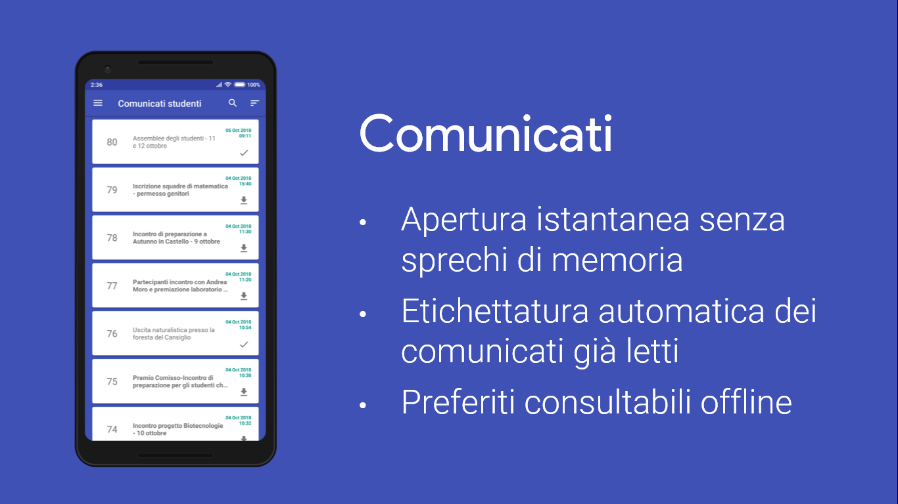
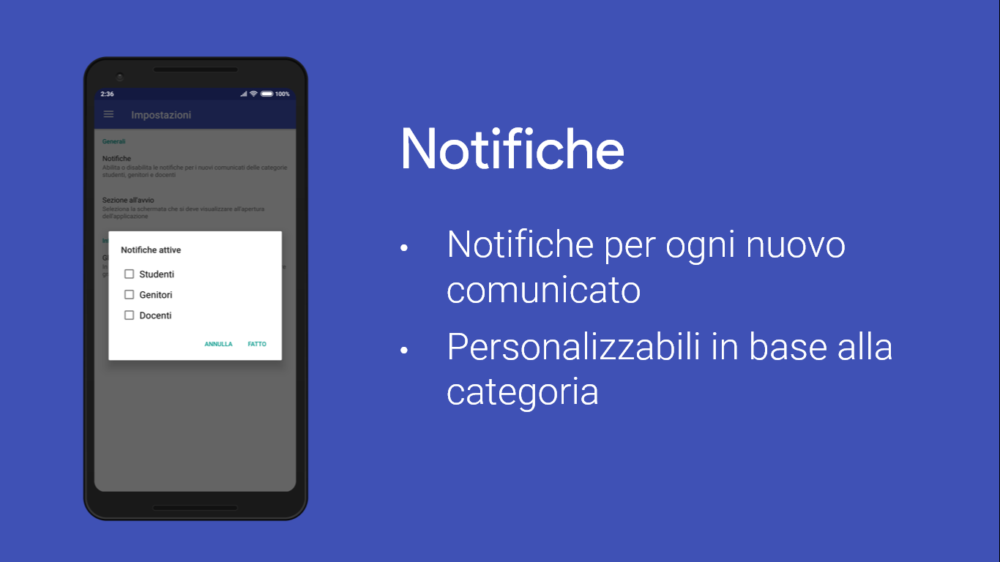
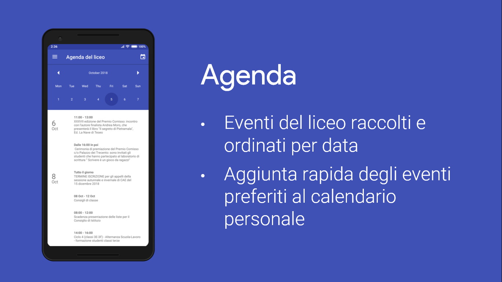
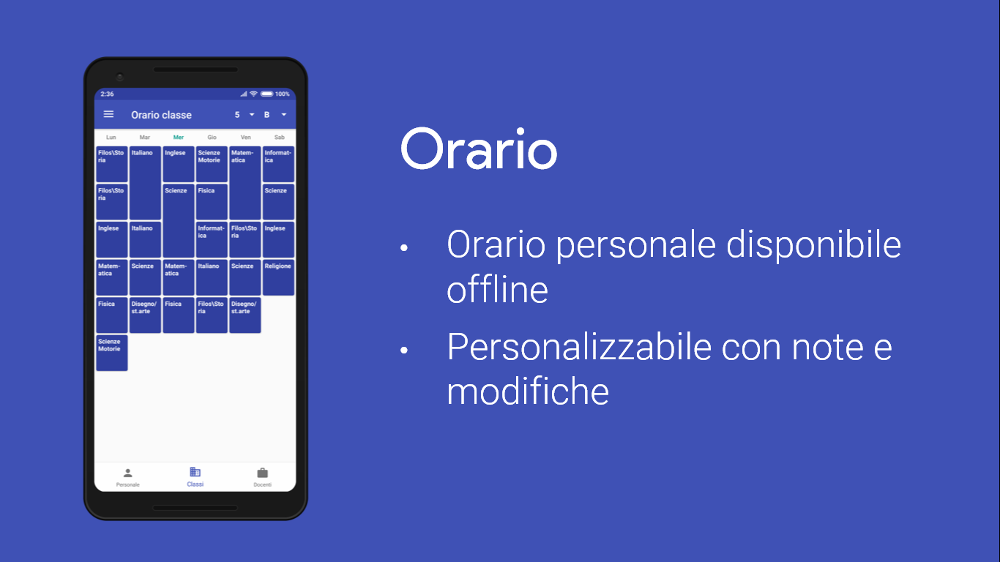
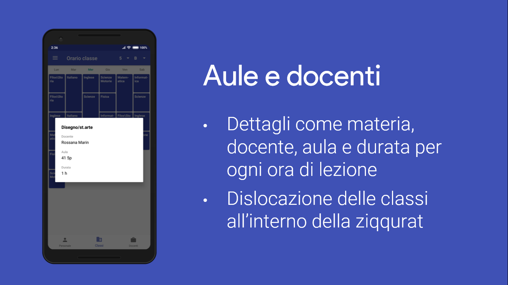

<h1 align="center">Liceo Da Vinci App</h1>
 

 

    <!-- Latest Release -->
    
    <!-- CoC -->
		

# Index

- [Comunicato del preside](https://github.com/emanuele-cason/LiceoDaVinciApp/blob/master/Comunicato%20Preside%20pubblicazione%20app.pdf)
- [Introduzione](#Introduzione)
- [Installazione](#Installazione)
- [Funzioni](#Funzioni)

# Introduzione

Questa repository contiene il codice sorgente dell'applicazione Android LiceoDaVinciApp, sviluppata dal sottoscritto in collaborazione con [Baldomo](https://github.com/Baldomo), artefice invece dello sviluppo dell'[API](https://github.com/Baldomo/webapi-dav) installata nel server del liceo, che fornisce al client i dati JSON relativi a comunicati, orari e agenda del Liceo.

**Allo stato attuale, in quanto non più studenti del Liceo, l'applicazione (client) e l'API (server) non sono più mantenute, ma rimaniamo disponibili per facilitare un eventuale passaggio di incarico a studenti volenterosi e capaci di aggiornare i relativi software e seguire il processo produttivo.**

# Installazione

A causa del mancato aggiornamento sopra citato, il download dell'applicazione è stato da noi sospeso dal Play Store, ma rimane disponibile nelle release di questa repository come demo/anteprima, sotto forma di apk. Si noti tuttavia che l'api potrebbe essere offline, coperta da polvere e ragnatele e in attesa di essere spolverata da qualche studente volenteroso, quindi non è sottointeso che l'applicazione riceva i dati necessari.

# Funzioni

 

 

 

 

 

# TODO

* Aggiungere laboratori prenotati
* Aggiungere seleziona pattern colori in impostazioni (per gli orari) o switch per decidere se generarli
* Aggiungere scelta pagina iniziale
* Risolvere errore problema grafico in Android Lollipop: immagine dell'header in bassa definizione
* Aggiungere Proguard, aggiungendo "-keep class com.shockwave.**" come da indicazioni: https://github.com/barteksc/AndroidPdfViewer
